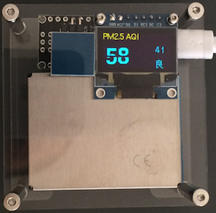
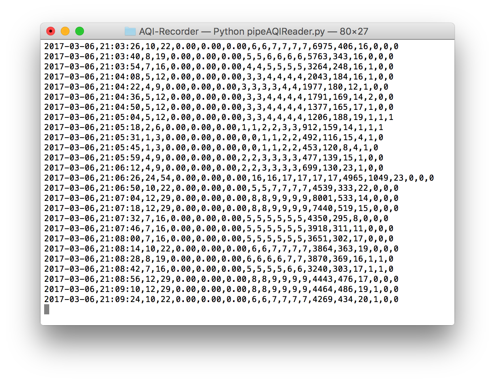
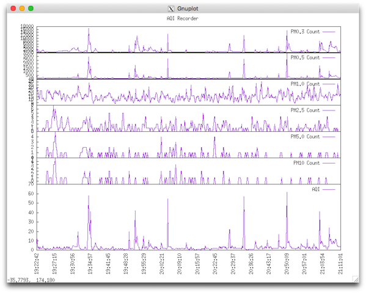

# AQI-Recorder

Here is my simple way to record and show Air Quality Index data.

1. A simple AQI sensor from __Taobao__:

    

2. Use [pipeAQIReader.py](https://github.com/tengshg/AQI-Recorder/blob/master/pipeAQIReader.py), Read the data from the sensor via USB-to-Serial port, and save the data to file:

    

3. Use the gnuplot script [aqi.plt](https://github.com/tengshg/AQI-Recorder/blob/master/aqi.plt) to show the data in real time:

    

----

Note that [pipeline.py](https://github.com/tengshg/AQI-Recorder/blob/master/pipeline.py) is based on the [presentation about coroutine](http://www.dabeaz.com/coroutines/index.html) from __David Beazley__. Even though the AQI reading here is so simple that no need to use the method, it's interesting to try that great idea. 
